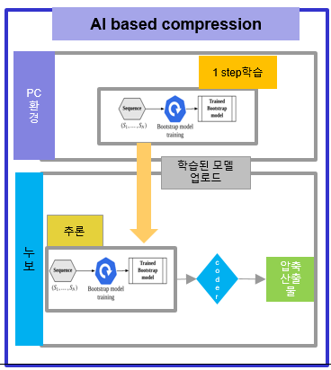
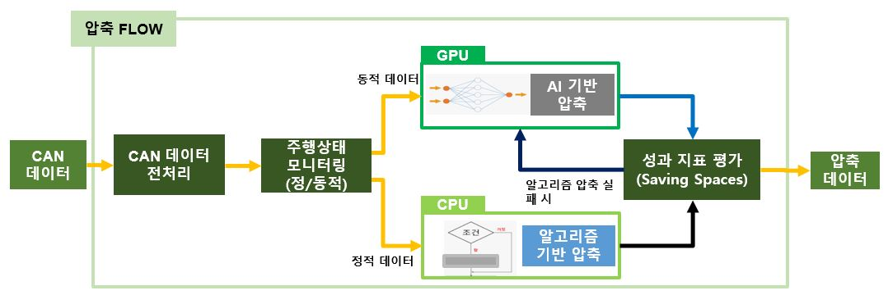
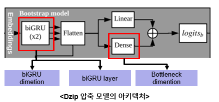

# Hybrid_compression_model 


### **1. Compression Code Directory Layout** 

- compression_dual.py(하이브리드 압축 모델)
- ai_based_compression.py(인공지능 압축 모델)
- rule_based_compression.py(규칙 기반 압축 모델)
- viewer.py(압축 진행 시각화)

  

### **2. Compression Code Manual**


**CAN 데이터 압축용 하이브리드 모델**

- 테스트 환경 : 누보-도커

- nvidia-docker 다운 후 도커 이미지 생성

```
docker pull nvidia/cuda:11.2.2-cudnn8-devel-ubuntu18.04
docker run -it --gpus all -d -v /tmp/.X11-unix:/tmp/.X11-unix -v /home/user:/root/data -e DISPLAY=unix$DISPLAY --env="NVIDIA_DRIVER_CAPABILITIES=all" --name compression_docker nvidia/cuda:11.2.2-cudnn8-devel-ubuntu18.04 /bin/bash
```

- 글로벌 환경 세팅

```
bash setup.sh
```

- 도커 환경 세팅 (도커 컨테이너 내에서 실행 - 권한 부분 제거)

```
bash docker_setup.sh
```

- 압축용 CAN 데이터 다운

```
bash CANDB_download.sh
```

**Pretrained model and configure file**

- 압축 모델 configure 및 weight 파일 다운

```
bash can_download_weight_cfg.sh
```


### AI 기반 모델 사용 방법



### 하이브리드 압축 모델 압축 과정



### AI Model Train

- 압축 모델(Dzip) 학습

- 파라미터 설정

  - infer_auto 내 하이퍼 파라미터 설정 필요

- 학습 시작

  - **bash 파일 내 학습 파라미터 설정 필요**

    

    - hd1 : biGRU dimention
    - hd2 : Bottleneck dimention
    - nls : biGRU layer 개수
    - bss : 배치 사이즈
    - epoch : 학습 에폭 개수

```
bash infer_auto.sh
```

- 학습 결과물은 모델 파라미터 이름 파일에 저장됨.

  - 학습 가중치 : train

  - 데이터 변환 딕셔너리 : 1.0s.params

  - 모델 하이퍼 파라미터 : train_hyper

  - 모델 인퍼런스를 위한 configure 파일 : dzip_param.json

    

### Hybrid Model Inference

- 하이브리드 압축을 위한 configure 파일 6가지 필요함.
  1. hybrid_param.json
     - 차량 상태 파악을 위한 CAN 정보 및 압축용 데이터 경로 포함되어 있음.
  2. train
  3. train_hyper
  4. 1.0s.params
  5. dzip_param.json
  6. zlib_param.json
     - 룰 기반 압축 configure 파일


- 압축 데이터 및 압축 설정 파일 포함되어 있음.

```
bash can_download_weight_cfg.sh
bash CANDB_download.sh
```


- bash 실행 후 압축 시작

```
bash CAN_COMPRESSION.sh
```

