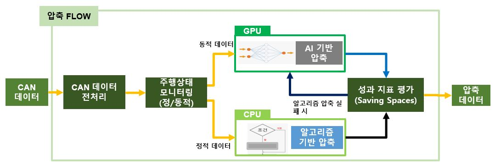
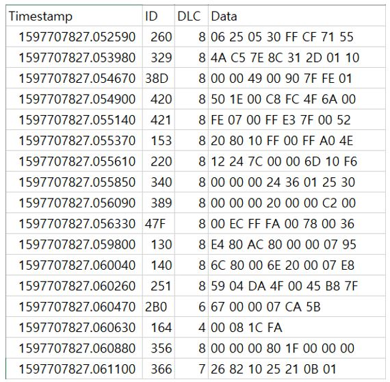
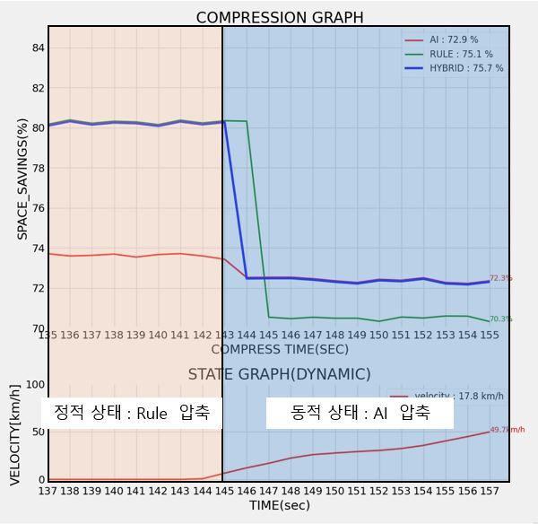

# Hybrid_compression_model


## Description

- AI 기반 압축 모델(Dzip)과 Rule 기반 압축(zlib)을 결합한 Hybrid 압축 모델 

  - 차량의 주행 상태에 따라 압축 방식을 달리하여 CAN 데이터를 압축함.
    - 차량 주행 상태에서는 AI 기반 압축 모델 활용
    - 차량 정차 상태에서는 Rule 기반 압축 모델 활용




## DATA

- CAN_DATA : CAR HACKING: ATTACK & DEFENSE CHALLENGE 2020

  - https://ieee-dataport.org/open-access/car-hacking-attack-defense-challenge-2020-dataset
    - CITATION : Hyunjae Kang, Byung Il Kwak, Young Hun Lee, Haneol Lee, Hwejae Lee, Huy Kang Kim, February 3, 2021, "Car Hacking: Attack & Defense Challenge 2020 Dataset", IEEE Dataport, doi: [https://dx.doi.org/10.21227/qvr7-n418](https://www.google.com/url?q=https%3A%2F%2Fdx.doi.org%2F10.21227%2Fqvr7-n418&sa=D&sntz=1&usg=AOvVaw33jtPkJFFezo3LcnKQmvju)
    
  - CAN 데이터 예시




- 해당 데이터 셋에서 정상 주행 및 정차 데이터만 압축에 사용하였음.
- AVANTE에서 수집된 C-CAN


## Hybrid Compression RESULT

- 압축 성능 지표는 Space savings 를 사용함.


- 2400개의 CAN 패킷을 파싱하여 Hybrid model로 압축 후 Space Savings 결과를 확인한 그래프 



- 주행 중 CAN 데이터의 동적 특성에 따라 AI 기반 압축 모델을 사용함
  -  평균 압축률 : 73%
- 정차 중 CAN 데이터의 정적 특성에 따라 Rule 기반 압축 모델 사용함
  - 평균 압축률 : 80%


## Environment

- Ubuntu 18.04
- CUDA 11.1
- cudnn 8
- docker
- Python 3.6.10


## How to Start

- 글로벌 환경 세팅

```
bash setup.sh
```


- 도커 환경 세팅

```
bash docker_setup.sh
```


**CITE**

- DZip: improved general-purpose loss less compression based on novel neural network modeling
  - https://github.com/mohit1997/Dzip-torch
