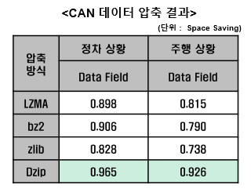
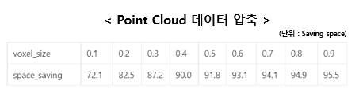
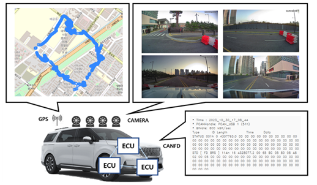
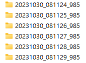
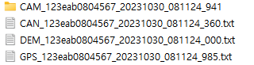
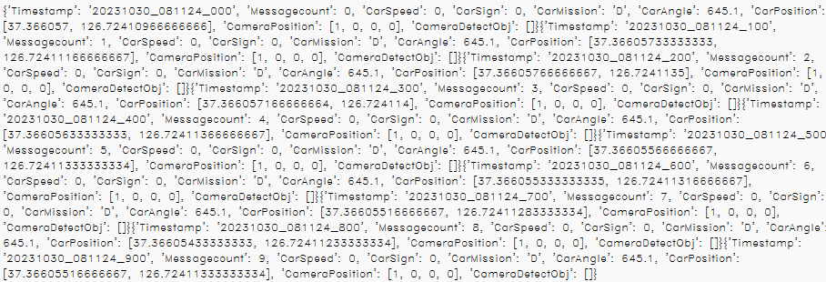
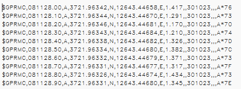
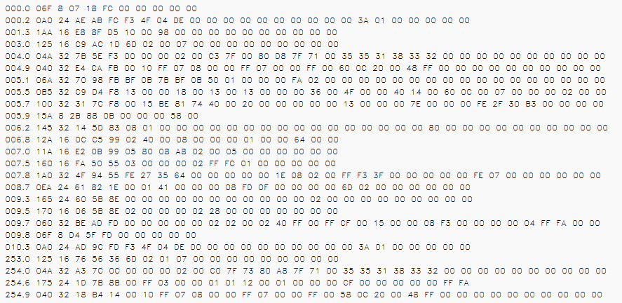
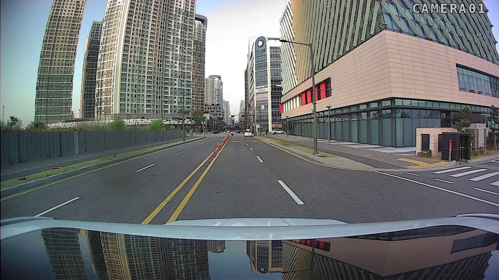

# 차량 내부 네트워크 데이터 압축 프로그램 모듈

- 차량 내부 네트워크 내 시계열 데이터 특성을 활용한 AI 기반 압축 SW

- Contributors : KETI(한국전자기술연구원)
- TASK : 차량 센서 데이터 압축 기술 구현

## Directory Layout

- Compression Code
  - AI_based_compression
  - Rule_based_compression

### Compression Code Description

- **AI_based_compression** : biGRU 기반 AI 압축 모델(Dzip)
  - 압축 성능이 좋으나 실시간 압축 불가 -> 하이브리드 압축 모델로 압축 방식 개선
  - version 1.0.0
- **Rule_based_compression** : 복셀라이제이션 기반 압축 모델
  - PCD 데이터 압축 방식 고도화 예정
  - version 1.0.0

# RESULT

### 압축 성능 지표

- 데이터 압축 성능 지표

 

### CAN Compression

- **AI 기반 압축 모델(Dzip) 및 룰셋 기반 압축 성능 비교**
  - 1차년도의 룰셋 기반 압축 알고리즘(LZMA, bz2, zlib)
  - 2차년도 AI 기반 압축 모델(Dzip)

- 정차 상황에서 룰셋 기반 압축의 성능(Space savings)은 주행 상황보다 높으며, AI 기반 압축 모델은 정차 및 주행 상황 모두에서 압축 성능이 뛰어남. 
- CAR HACKING: ATTACK & DEFENSE CHALLENGE 2020 데이터를 활용하여 압축함.

  - 주행 상황 : 12.9 MB
  - 정차 상황 : 12.3 MB

### Lidar Compression

- 2차년도 룰셋 기반 압축 모델(Voxelization)
  - Rule 기반 압축 모델 활용 차량 라이다 데이터 성능 평가

## Data open

- DEM(Driving Environment Monitoring) 메시지, CAM(이미지) 데이터, CANFD, GPS 데이터로 구성되어 있음
- 1초마다 생성된 데이터를 파싱하여 년월일_시분초_미리초 디렉토리에 저장함
- 디렉토리 내용 설명

- 디렉토리 내부 구조 (CAM, CAN, DEM, GPS 구성)

- 파싱된 데이터 내용
- CAM : 차량 상단에 설치된 전후좌우 카메라 데이터(1 Hz)
- CAN : 차량에서 생성된 CANFD 데이터 (1초 동안 수집)
- DEM : 차량에서 생성된 DEM 데이터 (10Hz)
- GPS : 차량에 설치된 GPS에서 생성된 데이터(10Hz)
- 데이터 샘플 예시

- DEM

- GPS

- CANFD

- CARMERA

링크 : https://drive.google.com/drive/folders/1eHA4Y8LepUrlAJCojASYY52QQPSNrpHZ?usp=drive_link

### version
- version 1.0.0
 - CAN Compression and Lidar Compression
   - CAN Compression : Dzip, Lidar Compression : Voxelization