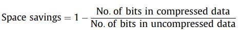
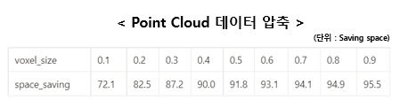

# Rule_based_compression


## Description

- Voxelization 기반 point cloud 손실 압축

  - point cloud 데이터를 Voxel로 변환하며 point cloud들의 중심점을 계산하고 나머지 point는 제거함.


- 멀티프로세스 기반 DEM, CANFD, IMAGE, GPS 압축
  - zip 기반의 실시간 데이터 압축 프로그램
​    

## DATA

- AI HUB 특수 환경 3D 이미지 데이터셋을 활용함

  https://www.aihub.or.kr/aihubdata/data/view.do?currMenu=115&topMenu=100&aihubDataSe=realm&dataSetSn=198
  - 해당 데이터 셋에서 Training -> incheo4->drive_1099를 활용하여 성능 평가를 진행함.

- SensorData_Parser 프로그램으로 수집한 데이터를 활용함
  - DEM, CANFD, IMAGE, GPS 데이터 1개씩
  - RAW_DATA_STORAGE_DIR 폴더


## Voxelization Compression RESULT

- 압축 성능 지표는 Space savings 를 사용함.

  




- 복셀 사이즈를 조절하여 압축 성능(Space savings)를 확인함.


- 주행 환경에 따라 압축 성능이 달라지며 Point Cloud 데이터가 뭉쳐있는 부분이 압축 성능이 향상됨.(최대 13%)


- 압축 성능이 향상되는 부분

  
### PCD 데이터
- 헤더


- 위에서 11번째 줄까지는 ascii(utf-8) 열리지만 아래부터는 바이너리로 저장된 PCD 데이터임
- 따라서, PCD 데이터를 확인하기 위해서는 12번째줄부터 바이너리로 읽어야함

## Environment

- Ubuntu 18.04
- python3.6.9
- open3d
- docker


## Download and install dependencies

- docker 환경에서 open3d 그래픽 랜더링이 필요하여 추가 라이브러리 설치 필요함.
  - setup.sh 파일에서 설치함
- 또한 도커 생성 시, NVIDIA 그래픽 드라이버 설정 필요

```
bash docker_setup.sh
```

- 글로벌 환경에서 setup

```
bash setup.sh
```


## HOW TO USE


### Data Compression

- bash 실행
  - 파라미터  사이즈 0.12

```
bash PCD_COMPRESSION.sh
```


- 입력 : 이미지 데이터 디렉토리, Point Cloud 데이터 디렉토리, Voxel_size, 뷰 옵션, 렌더링 옵션
- 출력 : 압축된 이미지 및 그래프

```
python3 Voxelization_compression.py --voxel_size [float] --pcd_data_dir [pcd dataset] --img_data_dir [image_data_dir] --camera_cali [calib_file] --render_param [rendering file]
```

 

- 사용 예시
  - 복셀라이제이션 파라미터 조정 : --voxel_size  

```
python3 Voxelization_compression.py --voxel_size 0.8
```


- 출력 결과 : 원본 이미지 압축결과 순서
  - 첫번째 그래프는 원본 Point 개수와 복셀라이제이션 후 Point 개수를 나타냄
  - 두번째 그래프는 Space Savinsg를 나타냄
  - Command line : 압축 로그 


- 멀티 프로세스 기반 압축 프로그램
  - DEM, CANFD, Image, GPS 데이터를 멀티 프로세스 기반으로 압축함
  - '--raw_data_path' : 압축 전 데이터 경로
  - '--compressed_data_path' : 압축 완료된 데이터 경로
- 실행 방법 (우분투 터미널 환경)
```
python3 RULE_COMPRESSION.py --raw_data_path=RAW_DATA_STORAGE_DIR --compressed_data_path=COMPRESSED_DATA_STORAGE_DIR
```