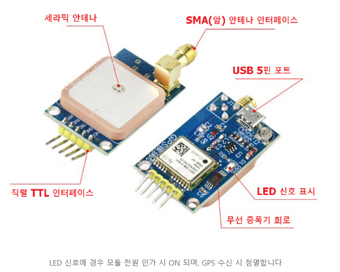
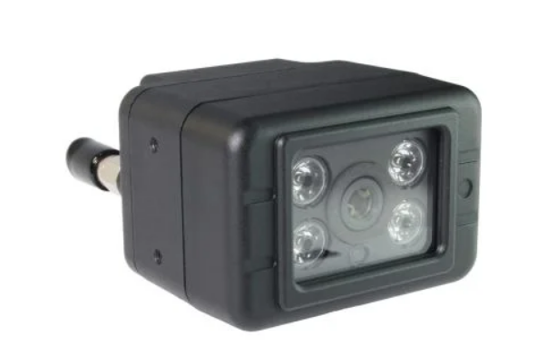
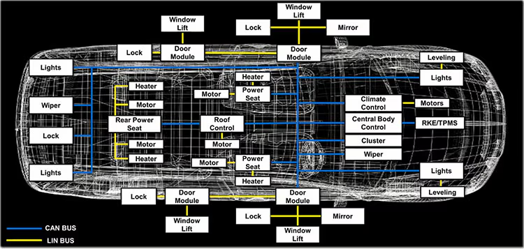

# 차량 센서 데이터 수집 프로그램

- 차량의 다종 센서(GPS, CANFD, Camera)에서 데이터를 수집하기 위한 프로그램

- Contributors : KETI(한국전자기술연구원)
- TASK : 차량 센서 데이터 수집

## File Layout
- GPS_read.py
- CAMERA_read.py
- CANFD_read.py
- SENSOR_PARSER.py

### GPS_read

- GPS 데이터 수집 환경
```
pip install pyubx2
pip install pyserial
```
- NMEA( The National Marine Electronics Association) 규격을 사용하는 데이터를 1초마다 수집함
- GPS 표준 프로토콜

### CAMERA_read

- CAMERA 데이터 수집 환경
```
pip install opencv-python
```
- RTSP를 활용하여 영상 데이터를 실시간으로 수집함
- 카메라 4대가 전,후,좌,우로 설치되어 있으며 1초에 카메라별 1장씩 데이터를 저장함

### CANFD_read

- CANFD 데이터 수집 환경
- CAN Logger 장치 사에서 제공하는 프로그램과 Local 통신하여 데이터 수집
- 1초 동안 데이터를 수집하여 저장함

### SENSOR_PARSER
- 각종 센서 데이터를 모아서 저장하는 프로그램
- 센서별 비동기적 프로세스를 multiprocessing을 활용 동시에 수집함

